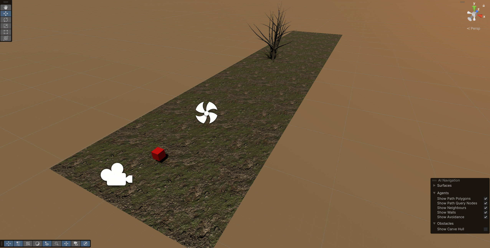
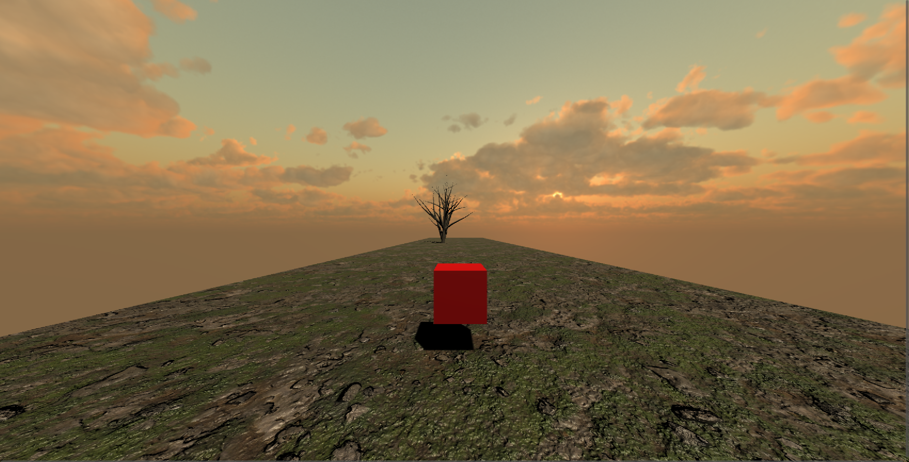

# Momentum - Infinite

**Momentum - Infinite** is an endless runner built with **Unity** (C#) where the terrain unfurls into the horizon, hazards appear randomly in your path, and the environment **evolves** the further you travel. Will your reflexes keep pace with the ever-shifting world?

<br/>

## Table of Contents
1. [Overview](#overview)  
2. [Screenshots](#screenshots)  
3. [Story & Atmosphere](#story--atmosphere)  
4. [Current Features](#current-features)  
5. [Future Plans](#future-plans)  
6. [How to Play](#how-to-play)  
7. [Technical Details](#technical-details)  
8. [Getting Started](#getting-started)  
9. [Contributing](#contributing)

<br/>

## Overview
In **Momentum - Infinite**, the player is thrust into an unending stretch of land that transforms as they progress. *Random objects* spawn on the path ahead. Some are simple obstacles. Others might be mysterious items that you’ll collect or avoid. Right now, it’s you, the road, and a handful of unpredictable hazards. But soon, the entire scene will evolve once you’ve traveled far enough, seamlessly shifting from a grassy plateau to perhaps an ice-capped mountain, or a futuristic city.

<br/>

## Screenshots
Below are a couple of in-editor and in-game screenshots demonstrating the current environment:

**Scene View (Editor):**  


**Game View (Play Mode):**  



<br/>

## Story & Atmosphere
- **Setting**: A desolate plain at dusk, with a solitary tree in the distance. The sky reveals a gentle sunset that transitions to deeper hues the farther you venture.
- **Mood**: A blend of wonder and caution; it’s a world on the brink of metamorphosis, responding to your progress in real time.
- **Goal**: Survive long enough to trigger the next environment shift, unveiling new terrains and obstacles.

> *“As you dash across the endless terrain, the horizon teases a new dawn, new mysteries, and new challenges.”*

<br/>

## Current Features
- **Infinite Terrain Generation**  
  Procedurally extends the ground as you move forward.
  
- **Random Spawning Objects**  
  Cubes, trees, or other placeholders appear unpredictably along your path.
  
- **Simple Controller**  
  A minimal character (or cube) that you can navigate to avoid obstacles.
  
- **Initial AI Navigation**  
  Early integration of Unity’s navigation surfaces in the environment.

<br/>

## Future Plans
1. **Dynamic Scene Changes**  
   - *Trigger environment transitions* once a set distance is covered (e.g., from desert to snowfields, or from farmland to futuristic cityscapes).
2. **Advanced Obstacles & Pick-Ups**  
   - Rolling boulders, rotating blades, power-ups, and collectibles to add variety and challenge.
3. **Scoring & Achievements**  
   - Leaderboards, distance trackers, and milestone achievements to push replayability.
4. **Character Progression**  
   - Skins, upgrades, or special abilities to evolve your runner as you play.
5. **Evaluation Algorithm**
   - Dynamic evaluation report of the environment generated.

<br/>

## How to Play
1. **Run forward** using basic 'W','A','D' and 'Space'  
2. **Dodge obstacles**: Spawning randomly in your path.  
3. Keep going! The longer you run, the more points or progress you earn.  
4. Stay alert for a *change in scenery*—this is your sign you’ve reached new territory!

<br/>

## Technical Details
- **Engine**: [Unity 6 (6000.0.35f1) — Windows, Mac, Linux, DX11]  
- **Language**: C#  
- **Project Structure**:
  - `Assets/`  
    - `Scripts/` – Core logic for the player, terrain generation, and spawners  
    - `Scenes/` – Main scene (`Ground Level`) plus any additional test scenes  
    - `Materials/`, `Textures/`, `Prefabs/` – Organized into subfolders as the project grows  
  - `Packages/` – Unity packages (AI Navigation, etc.)  
  - `ProjectSettings/` – Unity config files

<br/>

## Getting Started
1. **Clone the repository** from GitHub:
   ```bash
   git clone https://github.com/YourUsername/Momentum-Infinite.git

2. **Open in Unity** (compatible with Unity 2021+ or above, though you might need to upgrade if prompted). 
3. **Install packages** if prompted by the Package Manager (AI Navigation, etc.). 
4. **Press Play** in the Unity Editor’s toolbar and start running! > 

**Note**: Make sure you have [Git LFS](https://git-lfs.github.com/) installed if the repo includes large assets.